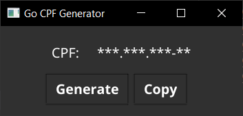

# Go CPF Generator

A Go program to randomly generate CPF (Cadastro de Pessoa Física) numbers.

Interface made with [Fyne](https://fyne.io/) toolkit.

## Usage

1. Click `Generate` button to generate a random new CPF number.
2. If after 5 tries it can't generate a valid CPF number, the initial mask is displayed. (This can only happen if a fully repeated sequence of numbers is generated. E.g.: 111111111-11).
3. Click `Copy` to copy to the clipboard.
4. Use it only to test your systems.